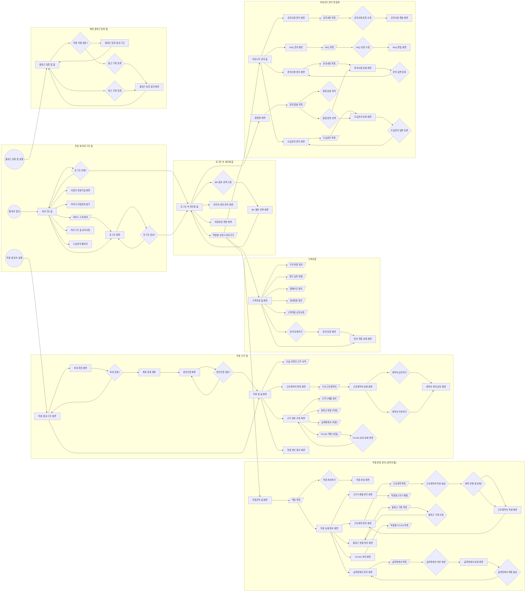

```mermaid
flowchart LR

  subgraph s1 ["진입 및 비로그인 홈"]
    n1(("웹 최초 접속"))
    n2(("직원 앱 최초 실행"))
    n3(("출퇴근 등록 앱 실행"))
    n4["비로그인 홈"]
    n5[/"서비스 소개 정보"/]
    n6["로그인 화면"]
    n7["사업자 회원가입 화면"]
    n8["아이디·비밀번호 찾기"]
    n9{"로그인 성공?"}
    n10{"로그인 상태?"}
    n96["비로그인 홈 공지사항"]
    n97["도입문의 페이지"]
  end

  subgraph s2 ["로그인 후 개인화 홈"]
    n11["로그인 후 개인화 홈"]
    n12[/"역할별 서비스 바로가기"/]
    n13{"BP·점포 선택 고정"}
    n14["BP·점포 선택 화면"]
    n15["관리자 정보 관리 화면"]
    n16["비밀번호 변경 화면"]
  end

  subgraph s3 ["직원 운영 관리 (관리자 웹)"]
    n17["직원관리 홈 화면"]
    n18[/"직원 목록"/]
    n19{"직원 초대하기"}
    n20["직원 초대 화면"]
    n21["직원 상세 정보 화면"]
    n22["근로계약 관리 화면"]
    n23[/"근로계약 목록"/]
    n24{"근로계약서 작성·발송"}
    n25["근로계약서 작성 화면"]
    n26{"계약 진행 중 존재?"}
    n27["근무스케줄 관리 화면"]
    n28[/"직원별 근무스케줄"/]
    n29["출퇴근 현황 관리 화면"]
    n30[/"출퇴근 기록 목록"/]
    n31{"출퇴근 기록 수정"}
    n32["급여명세서 관리 화면"]
    n33[/"급여명세서 목록"/]
    n34{"급여명세서 초안 생성"}
    n35["급여명세서 상세 화면"]
    n36{"급여명세서 확정·발송"}
    n37["TO-DO 관리 화면"]
    n38[/"직원별 TO-DO 목록"/]
  end

  subgraph s4 ["직원 근무 앱"]
    n39["직원 앱 로그인 화면"]
    n40["초대 확인 화면"]
    n41{"초대 유효?"}
    n42["계정 등록 화면"]
    n43["본인인증 화면"]
    n44{"본인인증 완료?"}
    n45["직원 앱 홈 화면"]
    n46[/"오늘·이번주 근무 요약"/]
    n47["근로계약서 목록 화면"]
    n48[/"수신 근로계약서"/]
    n49["근로계약서 상세 화면"]
    n50{"계약서 날인하기"}
    n51{"계약서 거부하기"}
    n52["계약서 처리 완료 화면"]
    n53["근무 정보 조회 화면"]
    n54[/"근무스케줄 정보"/]
    n55[/"출퇴근 현황 (직원)"/]
    n56[/"급여명세서 (직원)"/]
    n57[/"TO-DO 목록 (직원)"/]
    n58{"TO-DO 완료 상태 변경"}
    n59["직원 본인 정보 화면"]
  end

  subgraph s5 ["매장 출퇴근 등록 앱"]
    n60["출퇴근 등록 앱 홈"]
    n61{"직원 식별 완료?"}
    n62["출퇴근 등록 앱 로그인"]
    n63{"출근 기록 등록"}
    n64{"퇴근 기록 등록"}
    n65["출퇴근 등록 결과 화면"]
  end

  subgraph s6 ["고객지원"]
    n66["고객지원 홈 화면"]
    n67[/"구독 현황 정보"/]
    n68[/"청구·납부 현황"/]
    n69[/"결제수단 정보"/]
    n70[/"정산현황 정보"/]
    n71[/"고객지원 공지사항"/]
    n72{"문의 등록하기"}
    n73["문의 등록 화면"]
    n74["문의 목록·상세 화면"]
  end

  subgraph s7 ["커뮤니티 관리 및 알림"]
    n75["커뮤니티 관리 홈"]
    n76["공지사항 관리 화면"]
    n77[/"공지사항 목록"/]
    n78{"공지사항 등록·수정"}
    n79["공지사항 편집 화면"]
    n80["FAQ 관리 화면"]
    n81[/"FAQ 목록"/]
    n82{"FAQ 등록·수정"}
    n83["FAQ 편집 화면"]
    n84["문의사항 관리 화면"]
    n85[/"문의사항 목록"/]
    n86["문의사항 상세 화면"]
    n87{"문의 답변 등록"}
    n88["도입문의 관리 화면"]
    n89[/"도입문의 목록"/]
    n90["도입문의 상세 화면"]
    n91{"도입문의 답변 등록"}
    n92["알림함 화면"]
    n93[/"운영 알림 목록"/]
    n94{"알림 읽음 처리"}
    n95{"알림 항목 선택"}
  end

  n1 --> n4
  n4 --> n5
  n4 --> n10
  n10 --> n11
  n10 --> n4
  n5 --> n6
  n4 --> n6
  n4 --> n7
  n4 --> n8
  n4 --> n97
  n4 --> n96
  n6 --> n9
  n9 --> n11
  n9 --> n6
  n11 --> n12
  n11 --> n13
  n13 --> n14
  n14 --> n11
  n11 --> n15
  n11 --> n16
  n12 --> n17
  n12 --> n66
  n12 --> n75
  n17 --> n18
  n18 --> n19
  n19 --> n20
  n18 --> n21
  n21 --> n22
  n22 --> n23
  n23 --> n24
  n24 --> n26
  n26 --> n25
  n26 --> n25
  n25 --> n22
  n21 --> n27
  n27 --> n28
  n21 --> n29
  n29 --> n30
  n30 --> n31
  n31 --> n29
  n21 --> n32
  n32 --> n33
  n33 --> n34
  n34 --> n35
  n35 --> n36
  n36 --> n32
  n21 --> n37
  n37 --> n38
  n2 --> n39
  n39 --> n40
  n40 --> n41
  n41 --> n42
  n41 --> n39
  n42 --> n43
  n43 --> n44
  n44 --> n45
  n44 --> n43
  n45 --> n46
  n45 --> n47
  n47 --> n48
  n48 --> n49
  n49 --> n50
  n49 --> n51
  n50 --> n52
  n51 --> n52
  n45 --> n53
  n53 --> n54
  n53 --> n55
  n53 --> n56
  n53 --> n57
  n57 --> n58
  n58 --> n53
  n45 --> n59
  n39 --> n45
  n3 --> n60
  n60 --> n61
  n61 --> n63
  n61 --> n62
  n62 --> n60
  n63 --> n65
  n64 --> n65
  n60 --> n64
  n66 --> n67
  n66 --> n68
  n66 --> n69
  n66 --> n70
  n66 --> n71
  n66 --> n72
  n72 --> n73
  n73 --> n74
  n66 --> n74
  n75 --> n76
  n76 --> n77
  n77 --> n78
  n78 --> n79
  n75 --> n80
  n80 --> n81
  n81 --> n82
  n82 --> n83
  n75 --> n84
  n84 --> n85
  n85 --> n86
  n86 --> n87
  n75 --> n88
  n88 --> n89
  n89 --> n90
  n90 --> n91
  n11 --> n92
  n92 --> n93
  n93 --> n94
  n93 --> n95
  n95 --> n86
  n95 --> n90
  n65 --> n60
  n87 --> n84
  n91 --> n88
```
